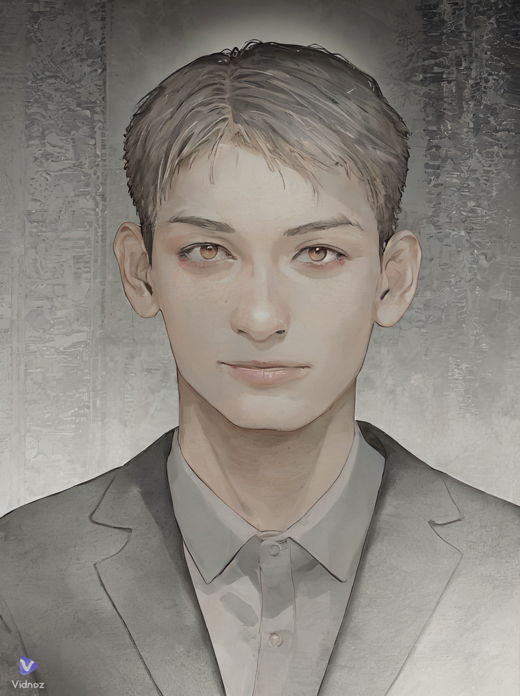

  

<!-- 

<!-- - 👋 Hi, I’m @your294
- 👀 I’m interested in TypeScript/JavaScript/CSS
- 🌱 I’m currently learning TypeScript with Vue and React
- ✔  I'm practice CSS to become a master in CSS to make animation and beatiful pages
- 💞️ I’m looking to collaborate on the man who are interested in web and webGL
- 📫 use can use the e-mail 2548077705@qq.com to reach me -->

<!---
your294/your294 is a ✨ special ✨ repository because its `README.md` (this file) appears on your GitHub profile.
You can click the Preview link to take a look at your changes.
--->

